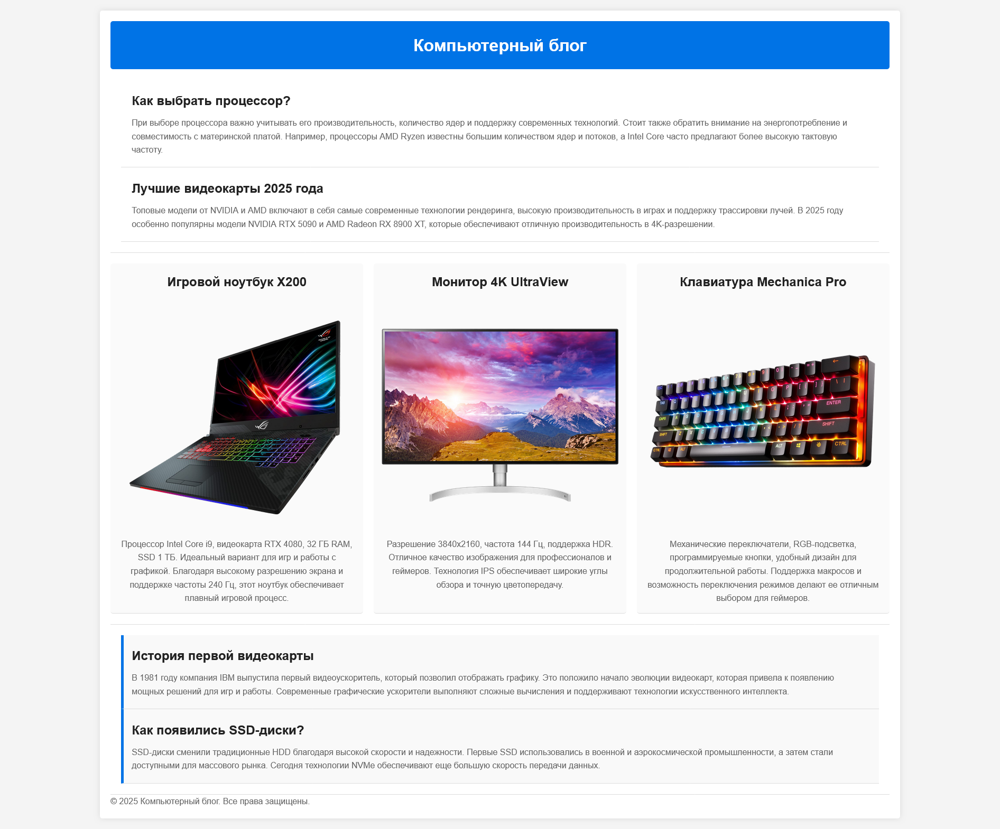

# Верстка страниц

## Срок сдачи работ

Последний коммит и пул реквест должен быть оформлен до 28.03.2025 23:59

## Цель:

Используя только CSS, оформить готовую HTML-страницу так, чтобы все элементы корректно располагались.

Условия:

- Вам дан файл index.html с готовой структурой страницы.
- Подключить CSS файл
- Написать CSS-правила, чтобы верстка была согласно макету

_Обратите, что тут используются все свойства, которые мы проходили, включая то, что было в блочной модели_

### Использованные цвета

`#f4f4f4`, `#333`, `#fff`, `#0073e6`, `#ddd`, `#222`, `#666`, `#fafafa`, `#f9f9f9`

### Использованные шрифты

`Arial`

_Перед началом работы не забудьте применить CSS reset - добавьте его в начало своего CSS файла_

```CSS
* {
    box-sizing: border-box;
    margin: 0;
    padding: 0;
}
```

## Готовый макет



# Теория

## 1. Структура любой страницы — начни отсюда

```html
<!DOCTYPE html>
<html lang="ru">
<head>
  <meta charset="UTF-8">
  <meta name="viewport" content="width=device-width, initial-scale=1.0">
  <title>Моя страница</title>
  <link rel="stylesheet" href="style.css">
</head>
<body>
  <header>Шапка</header>
  <main>Основной контент</main>
  <footer>Подвал</footer>
</body>
</html>
```

**Обязательный CSS-сброс в начале style.css:**
```css
* {
  box-sizing: border-box;
  margin: 0;
  padding: 0;
}
```

---

## 2. Box Model — как браузер считает размеры

Каждый элемент — это коробка из 4 слоёв:

```
┌──────────────────────────────┐
│           margin             │  ← внешний отступ (прозрачный)
│  ┌────────────────────────┐  │
│  │        border          │  │  ← рамка
│  │  ┌──────────────────┐  │  │
│  │  │     padding      │  │  │  ← внутренний отступ
│  │  │  ┌────────────┐  │  │  │
│  │  │  │  content   │  │  │  │  ← сам контент
│  │  │  └────────────┘  │  │  │
│  │  └──────────────────┘  │  │
│  └────────────────────────┘  │
└──────────────────────────────┘
```

```css
.box {
  width: 300px;       /* ширина контента */
  height: 200px;      /* высота контента */
  padding: 20px;      /* отступ внутри */
  border: 2px solid black;
  margin: 16px;       /* отступ снаружи */
}
```

> **Важно:** `box-sizing: border-box` (из сброса выше) делает так, что `width` включает padding и border. Без него — только контент, и размеры "плывут". Всегда используй сброс!

**Сокращённая запись:**
```css
/* все стороны одинаково */
margin: 16px;

/* вертикаль | горизонталь */
padding: 10px 20px;

/* верх | право | низ | лево */
margin: 10px 20px 30px 40px;
```

---

## 3. width и height — размеры элемента

```css
/* Фиксированные */
width: 300px;
height: 150px;

/* Относительные — % от родителя */
width: 100%;       /* на всю ширину родителя */
width: 50%;        /* половина родителя */

/* Ограничения */
max-width: 1200px; /* не шире 1200px — используй для контейнеров */
min-height: 100vh; /* минимум — вся высота экрана */
```

**Типичный контейнер страницы:**
```css
.container {
  max-width: 1200px;
  width: 100%;
  margin: 0 auto;   /* центрирует блок по горизонтали */
  padding: 0 16px;  /* боковые отступы на мобильных */
}
```

---

## 4. display — как элемент ведёт себя в потоке

| Значение | Поведение |
|---|---|
| `block` | Занимает всю ширину, новая строка. `div`, `p`, `h1` по умолчанию |
| `inline` | Размер по контенту, в строку. `span`, `a` по умолчанию. **Игнорирует width/height** |
| `inline-block` | В строку, но слушается width/height |
| `flex` | Включает Flexbox для дочерних элементов |
| `grid` | Включает Grid для дочерних элементов |
| `none` | Скрывает элемент полностью (не занимает место) |

```css
/* сделать inline-элемент управляемым */
span {
  display: inline-block;
  width: 100px;
  padding: 8px;
}
```

---

## 5. position — вырываем элемент из потока

| Значение | Относительно чего | Занимает место в потоке? |
|---|---|---|
| `static` | — (по умолчанию) | ✅ да |
| `relative` | самого себя | ✅ да |
| `absolute` | ближайшего positioned-родителя | ❌ нет |
| `fixed` | окна браузера | ❌ нет |
| `sticky` | родителя при скролле | ✅ да |

```css
/* relative — смещаем, но место остаётся */
.label {
  position: relative;
  top: 5px;    /* смещение вниз на 5px */
  left: 10px;
}

/* absolute — точное позиционирование внутри родителя */
.parent {
  position: relative; /* ← ОБЯЗАТЕЛЬНО на родителе! */
}
.badge {
  position: absolute;
  top: 10px;
  right: 10px;
}

/* fixed — прилипает к экрану */
.navbar {
  position: fixed;
  top: 0;
  left: 0;
  width: 100%;
  z-index: 100; /* поверх всего */
}

/* sticky — прилипает при скролле */
.sidebar {
  position: sticky;
  top: 20px;
}
```

> **Ловушка с absolute:** элемент позиционируется относительно ближайшего родителя с `position` не равным `static`. Если такого нет — относительно `<body>`. Всегда добавляй `position: relative` на нужный родитель!

---

## 6. Типовая структура страницы целиком

```css
/* Общий сброс */
* {
  box-sizing: border-box;
  margin: 0;
  padding: 0;
}

body {
  font-family: sans-serif;
  min-height: 100vh;
  display: flex;
  flex-direction: column;
}

/* Фиксированная шапка */
header {
  position: fixed;
  top: 0;
  width: 100%;
  height: 60px;
  background: #fff;
  z-index: 100;
}

/* Контент не уходит под шапку */
main {
  margin-top: 60px;
  flex: 1;               /* растягивает main, прижимает footer вниз */
  padding: 24px 16px;
}

/* Контейнер по центру */
.container {
  max-width: 1200px;
  width: 100%;
  margin: 0 auto;
}

footer {
  padding: 24px;
  background: #f5f5f5;
  text-align: center;
}
```

# Как сдавать

- Создайте форк репозитория в вашей организации с названием-этого-репозитория-вашафамилия
- Используя ветку wip сделайте задание
- Зафиксируйте изменения в вашем репозитории
- Когда документ будет готов - создайте пул реквест из ветки wip (вашей) на ветку main (тоже вашу) и укажите меня (ktkv419) как reviewer

Не мержите сами коммит, это сделаю я после проверки задания
